## 1. Tagged Pointer 是什么？

---

>   `Tagged Pointer` 是苹果为了在 `64` 位架构的处理器下节省内存占用和提高运行效率而提出的概念。它的本质是把一些占用内存较小的对象的数据（`NSSting`、`NSData`、`NSNumber`）直接放在指针的内存空间内，然后把这个指针直接作为对象使用，直接省去了为对象在堆区开辟空间的过程。
>
>  传统上，`Objective-C` 对象都是通过指针引用的，指针指向一个存储在堆内存中的对象实例。然而`Tagged Pointer`通过修改指针的最低有效位来存储一些简单的值，如整数、浮点数、布尔值等。这样，当对象的大小小于一个指针的大小时，可以直接将数据存储在指针中，而不需要额外的内存分配。这种方式避免了内存分配和释放的开销，提高了程序的性能和内存利用率。
>  

`Tagged Pointer` 是标记指针，它具有以下特点：

* Tagged Pointer指针的值不再是地址了，而是真正的值。所以，实际上它不再是一个对象了，它只是一个披着对象皮的普通变量而已。
* 它的内存并不存储在堆中，也不需要 malloc 和 free，不走引用计数那一套逻辑，由系统来处理释放。
* 在内存读取上有着 3 倍的效率，创建时比以前快 106 倍。
* 可以通过设置环境变量`OBJC_DISABLE_TAGGED_POINTERS`来有开发者决定是否使用这项技术。


### 1.1 在引入Tagged Pointer 技术之前

`NSNumber`等对象存储在堆上，`NSNumber`的指针中存储的是堆中`NSNumber`对象的地址值，如图：

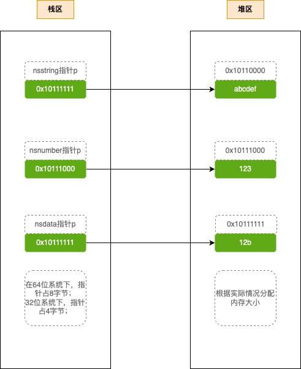

 其中`NSString`、`NSData`、`NSNumber`指针存储在栈区，数据存储在堆区。

#### 1.1-1 从内存占用来看

基本数据类型所需的内存不大。比如`NSInteger`变量，它所占用的内存是与 `CPU` 的位数有关，如下。在 `32 bit` 下占用 `4` 个字节，而在 `64 bit` 下占用 `8` 个字节。指针类型的大小通常也是与 `CPU` 位数相关，一个指针所在 `32 bit` 下占用 `4` 个字节，在 `64 bit` 下占用 `8` 个字节。

```c++
#if __LP64__ || 0 || NS_BUILD_32_LIKE_64
typedef long NSInteger;
typedef unsigned long NSUInteger;
#else
typedef int NSInteger;
typedef unsigned int NSUInteger;
#endif
```

假设我们通过`NSNumber`对象存储一个`NSInteger`的值，系统实际上会给我们分配多少内存呢？ 由于`Tagged Pointer`无法禁用，所以以下将变量`i`设了一个很大的数，以让`NSNumber`对象存储在堆上。

>**备注：** 可以通过设置环境变量`OBJC_DISABLE_TAGGED_POINTERS`为`YES`来禁用`Tagged Pointer`，但如果你这么做，运行就`Crash`。
>
>```objective-c
>objc[39337]: tagged pointers are disabled
>(lldb) 
>```
>
>因为`Runtime`在程序运行时会判断`Tagged Pointer`是否被禁用，如果是的话就会调用`_objc_fatal()`函数杀死进程。所以，虽然苹果提供了`OBJC_DISABLE_TAGGED_POINTERS`这个环境变量给我们，但是`Tagged Pointer`还是无法禁用。

```objective-c
NSInteger i = 0xFFFFFFFFFFFFFF;
NSNumber *number = [NSNumber numberWithInteger:i];
NSLog(@"%zd", malloc_size((__bridge const void *)(number))); // 32
NSLog(@"%zd", sizeof(number)); // 8

```

由于`NSNumber`继承自`NSObject`，所以有`isa`指针，加上内存对齐的处理，系统给`NSNumber`对象分配了 32 个字节内存。通过 LLDB 指令读取它的内存，实际上它并没有用完 32 个字节。

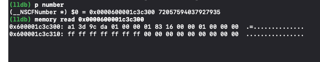

内存分配情况如下：

* `32`系统下，在栈内分配`4`个字节内存，在堆中分配如下：
  * `NSNumber` 实例对象，堆内存分配`16`个字节；
* `64`系统下，在栈内分配`8`个字节内存，在堆中分配如下：
  * `NSNumber` 实例对象，堆内存分配`32`个字节；

NSString`实例对象 内存布局比较复杂，后续会讲解。

<table><tr><td bgcolor=DarkSeaGreen>
  这里要思考一下，为什么memory read number内存0x600001c3c300，isa指针+内存对齐占用了16字节？后面文章《内存对齐》会详细讲。
</td></tr></table>

从以上可以得知，在 64 bit 下，如果没有使用`Tagged Pointer`的话，为了使用一个`NSNumber`对象就需要 8 个字节指针内存和 32 个字节对象内存。而直接使用一个`NSInteger`变量只要 8 个字节内存，相差好几倍。但总不能弃用`NSNumber`对象而改用基本数据类型吧。

#### 1.1-2 从效率上来看

为了使用一个`NSNumber`、`NSString`、`NSData`等较小对象，需要在堆上为其分配内存，还要维护它的引用计数，管理它的生命周期，实在是影响执行效率。

### 1.2 在引入 Tagged Pointer 技术之后

`NSNumber`等对象的值直接存储在了指针中，不必在堆上为其分配内存，节省了很多内存开销。在性能上，有着 3 倍空间效率的提升以及 106 倍创建和销毁速度的提升。

`NSNumber`等对象的指针中存储的数据变成了`Tag`+`Data`形式（`Tag`为特殊标记，用于区分`NSNumber`、`NSDate`、`NSString`等对象类型；`Data`为对象的值）。这样使用一个`NSNumber`对象只需要 8 个字节指针内存。当指针的 8 个字节不够存储数据时，才会在将对象存储在堆上。

我们再来看一下如果使用了`Tagged Pointer`，系统会给`NSNumber`对象分配多少内存。

```objective-c
NSInteger i = 1;
NSNumber *number = [NSNumber numberWithInteger:i];
NSLog(@"%zd", malloc_size((__bridge const void *)(number))); // 0
NSLog(@"%zd", sizeof(number)); // 8
```

可见，使用了`Tagged Pointer`，`NSNumber`对象的值直接存储在了指针上，不会在堆上申请内存。则使用一个`NSNumber`对象只需要指针的 8 个字节内存就够了，大大的节省了内存占用。

## 2. Tagged Pointer 的原理

---

源码是基于`runtime`的`obj4-779.1`版本

关于`Tagged Pointer`相关的宏定义，函数定义在`objc-internal.h`，函数实现在`objc-runtime-new.mm`，权限控制在`objc-env.h`中。

### 2.1 系统是否支持Tagged Pointer 


```c++
// 仅在__arm_64 架构下支持 Tagged Pointer 
#if __LP64__
#define OBJC_HAVE_TAGGED_POINTERS 1
#endif

#if !__LP64__ 
#   define SUPPORT_TAGGED_POINTERS 0
#else
#   define SUPPORT_TAGGED_POINTERS 1
#endif
```

### 2.2 Tagged Pointer 相关代码定义以及注释

#### 2.2-1 相关注释

---

```c++
/***********************************************************************
* Tagged pointer objects.
*
* Tagged pointer objects store the class and the object value in the 
* object pointer; the "pointer" does not actually point to anything.
* 
* Tagged pointer objects currently use this representation:
* (LSB)
*  1 bit   set if tagged, clear if ordinary object pointer
*  3 bits  tag index
* 60 bits  payload
* (MSB)
* The tag index defines the object's class. 
* The payload format is defined by the object's class.
*
* If the tag index is 0b111, the tagged pointer object uses an 
* "extended" representation, allowing more classes but with smaller payloads:
* (LSB)
*  1 bit   set if tagged, clear if ordinary object pointer
*  3 bits  0b111
*  8 bits  extended tag index
* 52 bits  payload
* (MSB)
*
* Some architectures reverse the MSB and LSB in these representations.
*
* This representation is subject to change. Representation-agnostic SPI is:
* objc-internal.h for class implementers.
* objc-gdb.h for debuggers.
**********************************************************************/
```

解释：

* Tagged pointer 指针对象将class和对象数据存储在对象指针中，指针实际上不指向任何东西。
* Tagged pointer 当前使用此表示形式：
  * `LSB`和`MSB`布局分布
    1. `1 bit`标记是`Tagged Pointer`对象
    2. `3 bit` 属于标记类型
    3. `60 bit` 属于负载数据容量，也就是存储对象数据
  * 带扩展存储
    1. `1 bit` 标记是 `Tagged Pointer`
    2. `3 bits` 是 `0b111`
    3. `8 bits` 扩展标记格式
    4. `52 bits` 负载数据容量，（存储对象数据）

从注释中我们得知：

- `Tagged pointer`存储对象数据目前分为`60bits`负载容量和`52bits`负载容量。
- 类标识允许使用扩展形式

结论：

* `MacOS`下采用 `LSB（Least Significant Bit，即最低有效位`）为`Tagged Pointer`标识位
* `iOS`下则采用`MSB（Most Significant Bit，即最高有效位）`为`Tagged Pointer`标识位。

采用`MSB`时标记位布局如下：

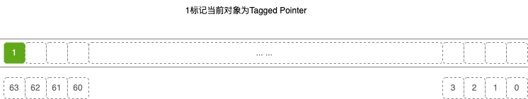

`LSB`和 `MSB`布局到底是一个怎么样的表现？那么如何判断负载容量？类标识的扩展类型有那些？我们来看下全面的`objc_tag_index_t`源码：

#### 2.2-2 objc_tag_index_t 枚举

```c++
{
    // 60-bit payloads
    OBJC_TAG_NSAtom            = 0, 
    OBJC_TAG_1                 = 1, 
    OBJC_TAG_NSString          = 2, 
    OBJC_TAG_NSNumber          = 3, 
    OBJC_TAG_NSIndexPath       = 4, 
    OBJC_TAG_NSManagedObjectID = 5, 
    OBJC_TAG_NSDate            = 6,

    // 60-bit reserved
    // 保留位
    OBJC_TAG_RESERVED_7        = 7, 

    // 52-bit payloads
    OBJC_TAG_Photos_1          = 8,
    OBJC_TAG_Photos_2          = 9,
    OBJC_TAG_Photos_3          = 10,
    OBJC_TAG_Photos_4          = 11,
    OBJC_TAG_XPC_1             = 12,
    OBJC_TAG_XPC_2             = 13,
    OBJC_TAG_XPC_3             = 14,
    OBJC_TAG_XPC_4             = 15,
    OBJC_TAG_NSColor           = 16,
    OBJC_TAG_UIColor           = 17,
    OBJC_TAG_CGColor           = 18,
    OBJC_TAG_NSIndexSet        = 19,
    OBJC_TAG_NSMethodSignature = 20,
    OBJC_TAG_UTTypeRecord      = 21,
    OBJC_TAG_Foundation_1      = 22,
    OBJC_TAG_Foundation_2      = 23,
    OBJC_TAG_Foundation_3      = 24,
    OBJC_TAG_Foundation_4      = 25,


    OBJC_TAG_FirstUnobfuscatedSplitTag = 136, // 128 + 8, first ext tag with high bit set

    OBJC_TAG_Constant_CFString = 136,
    
    // 前60位负载内容
    OBJC_TAG_First60BitPayload = 0, 
    // 后60位负载内容
    OBJC_TAG_Last60BitPayload  = 6, 
    // 前52位负载内容
    OBJC_TAG_First52BitPayload = 8, 
    // 后52位负载内容
    OBJC_TAG_Last52BitPayload  = 263,
    
    // 保留位
    OBJC_TAG_RESERVED_264      = 264
};

```

根据枚举注释解释：

* `iOS`采用 `MSB` 布局
  1. 当`OBJC_TAG_First60BitPayload` <= `tag标识值` <= `OBJC_TAG_Last60BitPayload`,负载数据容量为`60bits`。
  2. 当  `tag标识值`  = `0b111(7)` 时，`tagged pointer`对象使用 “扩展” 表示形式，扩展占`8bits`，扩展类型为上面`OBJC_TAG_Photos_1` ～`OBJC_TAG_Foundation_4`，负载数据容量为`52bits`。
* `MacOS`采用 `LSB` 布局
  1. 当`OBJC_TAG_Last60BitPayload` <= `tag标识值` <= `OBJC_TAG_Last52BitPayload`,负载数据容量为`60bits`。
  2. 当  `tag标识值`  = `0b111(7)` 时，`tagged pointer`对象使用 “扩展” 表示形式，扩展占`8bits`，扩展类型为上面`OBJC_TAG_Photos_1` ～`OBJC_TAG_Foundation_4`，负载数据容量为`52bits`。

只要一个`tag`，既可以区分负载数据容量，也可以区分类标识。

根据上面源码的注释，可以得到在布局时的内存占用；根据枚举的设定，能得出布局的起始位置。

所以，`iOS`采用 `MSB` 时的布局分布：

* 未携带扩展内容的指针：

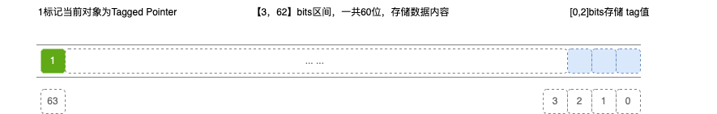

* 携带扩展内容的指针：

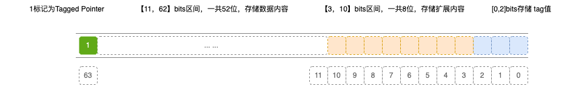

`MacOS`采用 `LSB` 布局分布：

* 未携带扩展内容的指针：

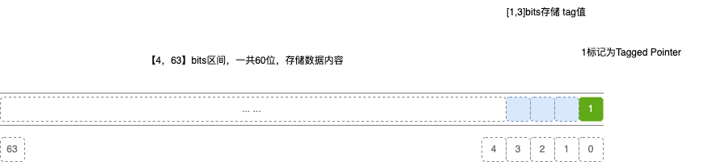

* 携带扩展内容的指针：

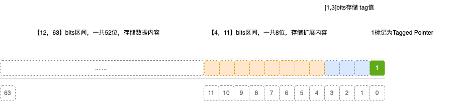

#### 2.2-3 宏定义

根据上述的解释，我们会对针对一些宏定义值的设定有所了解

```c++
// 该模式下，标记部分位于指针的高位
#if __arm64__
#   define OBJC_SPLIT_TAGGED_POINTERS 1
#else
#   define OBJC_SPLIT_TAGGED_POINTERS 0
#endif

// 仅举例OBJC_SPLIT_TAGGED_POINTERS 环境下

#   define _OBJC_TAG_MASK (1UL<<63) // __arm64__架构下，tagged Pointer对象的标志位
#   define _OBJC_TAG_INDEX_SHIFT 0 // tag的起始偏移位置

// 以下两个宏定义，在构建TaggedPointer标识指针时用到
#   define _OBJC_TAG_PAYLOAD_LSHIFT 1
#   define _OBJC_TAG_PAYLOAD_RSHIFT 4

#   define _OBJC_TAG_SLOT_SHIFT 0

// TODO：需进一步了解
#   define _OBJC_TAG_EXT_MASK (_OBJC_TAG_MASK | 0x7UL) // tag位111表示有扩展标记位
#   define _OBJC_TAG_NO_OBFUSCATION_MASK ((1UL<<62) | _OBJC_TAG_EXT_MASK) // 作用是带有扩展位的TaggerPointer对象不进行混淆操作
#   define _OBJC_TAG_CONSTANT_POINTER_MASK \
        ~(_OBJC_TAG_EXT_MASK | ((uintptr_t)_OBJC_TAG_EXT_SLOT_MASK << _OBJC_TAG_EXT_SLOT_SHIFT))
#   define _OBJC_TAG_EXT_INDEX_SHIFT 55
#   define _OBJC_TAG_EXT_SLOT_SHIFT 55
#   define _OBJC_TAG_EXT_PAYLOAD_LSHIFT 9
#   define _OBJC_TAG_EXT_PAYLOAD_RSHIFT 12
```


### 2.3 关闭 Tagged Pointer 的数据混淆

在iOS12系统之后，为了保证数据安全，苹果对 Tagged Pointer 做了数据混淆，开发者通过打印指针无法判断它是不是一个`Tagged Pointer`，更无法读取`Tagged Pointer`的存储数据。

所以在分析`Tagged Pointer`之前，我们需要先关闭`Tagged Pointer`的数据混淆，以方便我们调试程序。通过设置环境变量`OBJC_DISABLE_TAG_OBFUSCATION`为`YES`。

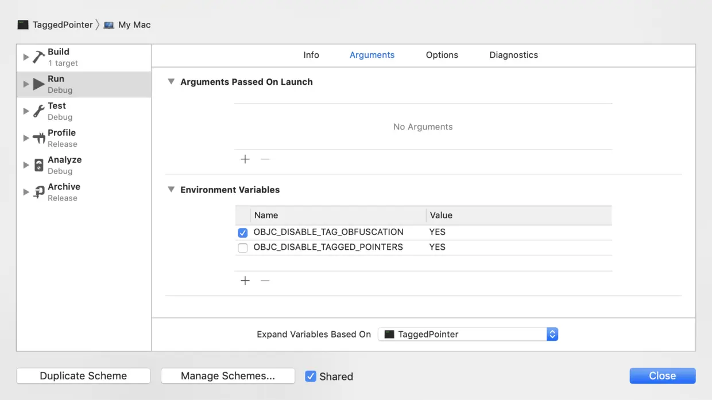

```objective-c
- (void)formatedLogObject:(id)object {
    if (@available(iOS 12.0, *)) {
        NSLog(@"%p %@ %@", object, object, object_getClass(object));
      // 0xa000000000000791 y NSTaggedPointerString
    } else {
        NSLog(@"0x%6lx %@ %@", object, object, object_getClass(object));
      // 0xcb47b8d98a2fa15f y NSTaggedPointerString
    }
}
```

`iOS12`之前打印指针的值能很清晰的看到数据等信息，`iOS12`之后系统则打印的完全看不懂了，看了源代码发现苹果是做了混淆，让我们不能直接得到值，从而避免我们去很容易就伪造出一个`tagged pointer`对象

#### 2.3-1 **苹果是如何混淆的了**

**源码分析**

根据动态库的加载，其中存在`_read_images`的方法，该方法中调用`initializeTaggedPointerObfuscator`方法，查看该方法源码，如下

```c++
static void
initializeTaggedPointerObfuscator(void)
{
    if (!DisableTaggedPointerObfuscation){
      // 这个随机数是在dyld加载image的时候去随机产生的，每次程序加载都不一样
        arc4random_buf(&objc_debug_taggedpointer_obfuscator,
                       sizeof(objc_debug_taggedpointer_obfuscator));
        objc_debug_taggedpointer_obfuscator &= ~_OBJC_TAG_MASK;
      
#if OBJC_SPLIT_TAGGED_POINTERS
        objc_debug_taggedpointer_obfuscator &= ~(_OBJC_TAG_EXT_MASK | _OBJC_TAG_NO_OBFUSCATION_MASK);
        int max = 7;
        for (int i = max - 1; i >= 0; i--) {
            int target = arc4random_uniform(i + 1);
            swap(objc_debug_tag60_permutations[i],
                 objc_debug_tag60_permutations[target]);
        }
#endif
    } else {
        objc_debug_taggedpointer_obfuscator = 0;
    }
}
```

查看`DisableTaggedPointerObfuscation`实际上是一个`bool`变量

```c++
#define OPTION(var, env, help) extern bool var;
OPTION( DisableTaggedPointerObfuscation, OBJC_DISABLE_TAG_OBFUSCATION,    "disable obfuscation of tagged pointers")
```

该变量在项目`target`的`schema`中配置如上图介绍，如果配置`OBJC_DISABLE_TAG_OBFUSCATION`为`YES`，则会将`objc_debug_taggedpointer_obfuscator`赋值为0；反之会赋值给一个随机数。

具体混淆的代码如下：

```c++
static inline void * _Nonnull
_objc_encodeTaggedPointer_withObfuscator(uintptr_t ptr, uintptr_t obfuscator)
{
  // ptr Tagged Pointer对象混淆前的地址
  // 混淆的逻辑就是：指针和随机值进行按位异或操作
    uintptr_t value = (obfuscator ^ ptr);
#if OBJC_SPLIT_TAGGED_POINTERS
    if ((value & _OBJC_TAG_NO_OBFUSCATION_MASK) == _OBJC_TAG_NO_OBFUSCATION_MASK)
        return (void *)ptr;
    uintptr_t basicTag = (value >> _OBJC_TAG_INDEX_SHIFT) & _OBJC_TAG_INDEX_MASK;
    uintptr_t permutedTag = _objc_basicTagToObfuscatedTag(basicTag);
    value &= ~(_OBJC_TAG_INDEX_MASK << _OBJC_TAG_INDEX_SHIFT);
    value |= permutedTag << _OBJC_TAG_INDEX_SHIFT;
#endif
    return (void *)value;
}
```

#### 2.3-2 **混淆之后怎么解密了**

根据异或的特性，对同一个数进行两次按位异或操作，会得到原来的值

```c++
static inline uintptr_t
_objc_decodeTaggedPointer_withObfuscator(const void * _Nullable ptr,
                                         uintptr_t obfuscator)
{
    uintptr_t value
      = _objc_decodeTaggedPointer_noPermute_withObfuscator(ptr, obfuscator);
#if OBJC_SPLIT_TAGGED_POINTERS
    uintptr_t basicTag = (value >> _OBJC_TAG_INDEX_SHIFT) & _OBJC_TAG_INDEX_MASK;

    value &= ~(_OBJC_TAG_INDEX_MASK << _OBJC_TAG_INDEX_SHIFT);
    value |= _objc_obfuscatedTagToBasicTag(basicTag) << _OBJC_TAG_INDEX_SHIFT;
#endif
    return value;
}
```

### 2.4 如何判断指针变量是 Tagged Pointer

定义于 `objc-object.h` 的 `isTaggedPointer` 函数，用来判断一个指针变量是否是 `Tagged Pointer`

```c++
inline bool objc_object::isTaggedPointer() 
{
    return _objc_isTaggedPointer(this);
}
```

关于`_objc_isTaggedPointer`函数，是定义于 `objc-internal.h` 中的一个返回 `bool` 类型的静态内联函数。

```c++
static inline bool
_objc_isTaggedPointer(const void * _Nullable ptr)
{
    return ((uintptr_t)ptr & _OBJC_TAG_MASK) == _OBJC_TAG_MASK;
}
```

可以看到，它是将指针值与一个`_OBJC_TAG_MASK`掩码进行按位与运算，`_OBJC_TAG_MASK`的值为`1lu << 63` ，转成二进制数：`1000 0000 0000 0000 0000 0000 0000 0000`；根据按位与的特性，都为`1`时结果为`1`，只有`ptr`指针的最高位为`1`时，才会和`_OBJC_TAG_MASK`相等。

#### 2.4-1 为何可通过设定最高位或最低位来标识 Tagged Pointer

首先我们通过代码验证一下

```c++
NSNumber *number2 = @1;
NSLog(@"number2 %p %@ %zu", number2, [number2 class], malloc_size(CFBridgingRetain(number2)));

// 非 Tagged Pointer
NSNumber *number3 = @(ffffffff);
// 我们使用uintptr_t类型（这是一个无符号整数类型，足够大以存储指针值）来存储指针的值。%016lx格式说明符用于打印64位的无符号长整数，并且以16进制的形式显示，前面填充0以确保总是显示16个数字。
uintptr_t value = (uintptr_t)number3;
NSLog(@"number3 0x%016lx %@ %zu", value, [number3 class], malloc_size(CFBridgingRetain(number3)));

number2 0x8000000000000093 __NSCFNumber 0 
number3 0x0000000102d7d3c0 NSConstantIntegerNumber 0 // 没有占满 64 位，最高位都是 0

```

​    分析打印结果，可看到所有 `Tagged Pointer` 的 `64` 位数据使用几乎都是满的，最高位都是 `1`，然而非`Tagged Pointer `对象最高位是没有占满的。

### 2.5 从 Tagged Pointer 指针中获取各个值

#### 2.5-1 获取所属类

首先我们先看一下源码的实现

```c++
static inline objc_tag_index_t
_objc_getTaggedPointerTag_withObfuscator(const void * _Nullable ptr,
                                         uintptr_t obfuscator)
{
    uintptr_t value = _objc_decodeTaggedPointer_withObfuscator(ptr, obfuscator);
    uintptr_t basicTag = (value >> _OBJC_TAG_INDEX_SHIFT) & _OBJC_TAG_INDEX_MASK;
    uintptr_t extTag =   (value >> _OBJC_TAG_EXT_INDEX_SHIFT) & _OBJC_TAG_EXT_INDEX_MASK;
    if (basicTag == _OBJC_TAG_INDEX_MASK) {
        return (objc_tag_index_t)(extTag + OBJC_TAG_First52BitPayload);
    } else {
        return (objc_tag_index_t)basicTag;
    }
}
```

代码解释如下：

* 获取到的`value`为解混淆后的指针；

* `Tagged Pointer`指针与`tag`位进行按位与操作，目的获取`tag`位的数值

  例如：`Tagged Pointer`指针为`0x800000092`，`_OBJC_TAG_EXT_INDEX_MASK` = `0x00000007`，按位与的结果为`0x00000002`，得到了`tag = 2`，所以该指针对象为`NSNumber`

接下来我们通过代码调试验证

##### **NSNumber对象**

```objective-c
NSNumber *number1 = [NSNumber numberWithInt:1];
NSLog(@"number %p %@ %zu", number, [number class], malloc_size(CFBridgingRetain(number)));

number 0x8000000000000093 __NSCFNumber 0
```

根据内存布局，我们获取`tag`位占`3 bits`，范围为`[0,2]`；我们获取最低位`3`，转化为二进制为`0011`，得到`tag`位值为`011 = 3`，根据`objc_tag_index_t`枚举得知，`3`正是`NSNumber`对象

##### NSString对象

```objective-c
NSString *str = [NSString stringWithFormat:@"1"];
NSLog(@"str %p %@ %zu", str, [str class], malloc_size(CFBridgingRetain(str)));

str 0x800000000000188a NSTaggedPointerString 0
```

获取最低位`a`，转化为二进制为`1010`，得到`tag`位值为`010 = 2`，根据`objc_tag_index_t`枚举得知，`2`正是`NSString`对象

##### 2.5-2 获取所属值

老套路，看一下源码的实现

```c++
static inline uintptr_t
_objc_getTaggedPointerValue(const void * _Nullable ptr) 
{
    uintptr_t value = _objc_decodeTaggedPointer(ptr);
    uintptr_t basicTag = (value >> _OBJC_TAG_INDEX_SHIFT) & _OBJC_TAG_INDEX_MASK;
    if (basicTag == _OBJC_TAG_INDEX_MASK) {
        return (value << _OBJC_TAG_EXT_PAYLOAD_LSHIFT) >> _OBJC_TAG_EXT_PAYLOAD_RSHIFT;
    } else {
        return (value << _OBJC_TAG_PAYLOAD_LSHIFT) >> _OBJC_TAG_PAYLOAD_RSHIFT;
    }
}

static inline intptr_t
_objc_getTaggedPointerSignedValue(const void * _Nullable ptr) 
{
    uintptr_t value = _objc_decodeTaggedPointer(ptr);
    uintptr_t basicTag = (value >> _OBJC_TAG_INDEX_SHIFT) & _OBJC_TAG_INDEX_MASK;
    if (basicTag == _OBJC_TAG_INDEX_MASK) {
        return ((intptr_t)value << _OBJC_TAG_EXT_PAYLOAD_LSHIFT) >> _OBJC_TAG_EXT_PAYLOAD_RSHIFT;
    } else {
        return ((intptr_t)value << _OBJC_TAG_PAYLOAD_LSHIFT) >> _OBJC_TAG_PAYLOAD_RSHIFT;
    }
}
```

代码解释如下：

* 获取到的`value`为解混淆后的指针；

* `Tagged Pointer`指针与`tag`位进行按位与操作，目的获取`tag`位的数值

* 根据`tag`值判断是否有扩展标记位

  * `不等于7`，则不包含扩展位

    `value << _OBJC_TAG_PAYLOAD_LSHIFT`，目的是清除指针标记位；然后`>> _OBJC_TAG_PAYLOAD_RSHIFT`，目的是清除`tag`标记位，

    这样剩余的`bits`全部是数据内容。

接下来我们通过代码调试验证

##### **NSNumber对象**

```objective-c
NSNumber *number1 = [NSNumber numberWithInt:1];
NSLog(@"number1 %p %@ %zu", number1, [number1 class], malloc_size(CFBridgingRetain(number1)));
    
NSNumber *number2 = [NSNumber numberWithChar:1];
NSLog(@"number2 %p %@ %zu", number2, [number2 class], malloc_size(CFBridgingRetain(number2)));
    
NSNumber *number3 = [NSNumber numberWithLong:1];
NSLog(@"number3 %p %@ %zu", number3, [number3 class], malloc_size(CFBridgingRetain(number3)));
    
NSNumber *number4 = [NSNumber numberWithBool:1];
NSLog(@"number4 %p %@ %zu", number4, [number4 class], malloc_size(CFBridgingRetain(number4)));
    
NSNumber *number5 = [NSNumber numberWithFloat:1.0];
NSLog(@"number5 %p %@ %zu", number5, [number5 class], malloc_size(CFBridgingRetain(number5)));
    
NSNumber *number6 = [NSNumber numberWithDouble:1];
NSLog(@"number6 %p %@ %zu", number6, [number6 class], malloc_size(CFBridgingRetain(number6)));
    
NSNumber *number7 = [NSNumber numberWithShort:1];
NSLog(@"number7 %p %@ %zu", number7, [number7 class], malloc_size(CFBridgingRetain(number7)));

number1 0x8000000000000093 __NSCFNumber 0
number2 0x8000000000000083 __NSCFNumber 0
number3 0x800000000000009b __NSCFNumber 0
number4 0x1df033ef8 __NSCFBoolean 0
number5 0x80000000000000a3 __NSCFNumber 0
number6 0x80000000000000ab __NSCFNumber 0
number7 0x800000000000008b __NSCFNumber 0
```

`number4`不属于`Tagged Pointer`对象，我们不对此分析

我们知道`tag`位仅占用了`3bits`，所以`tag`标记位的第四位属于数据位；我们好奇，为什么我们设置`value = 1`通过不同的函数创建，得到的指针值也是不同的？那么数据类型在数据负载区域是怎么存储的呢？

我们逐个分解上述的指针

```objective-c
number1 0x8000000000000093 => 0b 1000 0000 0000 0000 0000 0000 0000 0000 0000 0000 0000 0000 0000 0000 1001 0011
number2 0x8000000000000083 => 0b 1000 0000 0000 0000 0000 0000 0000 0000 0000 0000 0000 0000 0000 0000 1000 0011
number3 0x8000000000000083 => 0b 1000 0000 0000 0000 0000 0000 0000 0000 0000 0000 0000 0000 0000 0000 1001 1011
number5 0x8000000000000083 => 0b 1000 0000 0000 0000 0000 0000 0000 0000 0000 0000 0000 0000 0000 0000 1010 0011
number6 0x8000000000000083 => 0b 1000 0000 0000 0000 0000 0000 0000 0000 0000 0000 0000 0000 0000 0000 1010 1011
number7 0x8000000000000083 => 0b 1000 0000 0000 0000 0000 0000 0000 0000 0000 0000 0000 0000 0000 0000 1000 1011
```

观察上面，我们不难发现，`value = 1`存储在第`7 bit`中，由此我们可以得出结论：

* `NSNumber`对象的数据包括：具体数据+数据类型；数据类型占用`4 bits`，存储在`[3,6]`区间，数据占用`56 bits`，存储在`[7,62]`区间

* 数据类型的区分

  | Tagged Pointer 【3,6】bits | 对应数据类型 |
  | -------------------------- | ------------ |
  | 0000 = 0                   | char         |
  | 0001 = 1                   | short        |
  | 0010 = 2                   | int          |
  | 0011 = 3                   | long         |
  | 0100 = 4                   | float        |
  | 0101 = 5                   | double       |


我们可以完善一下`NSNumber`在`MBS`布局下的分布：

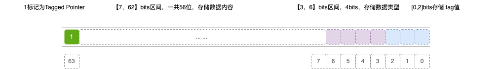

##### NSString对象

```objective-c
NSString *str1 = [NSString stringWithFormat:@"1"];
NSLog(@"str1 %p %@ %zu", str1, [str1 class], malloc_size(CFBridgingRetain(str1)));
    
NSString *str2= [NSString stringWithFormat:@"12"];
NSLog(@"str2 %p %@ %zu", str2, [str2 class], malloc_size(CFBridgingRetain(str2)));
    
NSString *str3 = [NSString stringWithFormat:@"12a"];
NSLog(@"str3 %p %@ %zu", str3, [str3 class], malloc_size(CFBridgingRetain(str3)));
    
NSString *str4 = [NSString stringWithFormat:@"123b"];
NSLog(@"str4 %p %@ %zu", str4, [str4 class], malloc_size(CFBridgingRetain(str4)));
    
NSString *str5 = [NSString stringWithFormat:@"1234c"];
NSLog(@"str5 %p %@ %zu", str5, [str5 class], malloc_size(CFBridgingRetain(str5)));

str1 0x800000000000188a NSTaggedPointerString 0
str2 0x8000000000191892 NSTaggedPointerString 0
str3 0x800000003099189a NSTaggedPointerString 0
str4 0x80000031199918a2 NSTaggedPointerString 0
str5 0x8000319a199918aa NSTaggedPointerString 0
```

同样操作，我们逐个分解上述的指针

```
str1 0x800000000000188a => 0b 1000 0000 0000 0000 0000 0000 0000 0000 0000 0000 0000 0000 0001 1000 1000 1010
str2 0x8000000000191892 => 0b 1000 0000 0000 0000 0000 0000 0000 0000 0000 0000 0001 1001 0001 1000 1001 0010
str3 0x800000003099189a => 0b 1000 0000 0000 0000 0000 0000 0000 0000 0011 0000 1001 1001 0001 1000 1001 1010
str4 0x80000031199918a2 => 0b 1000 0000 0000 0000 0000 0000 0011 0001 0001 1001 1001 1001 0001 1000 1010 0010
str5 0x8000319a199918aa => 0b 1000 0000 0000 0000 0011 0001 1001 1010 0001 1001 1001 1001 0001 1000 1010 1010
```

老操作，先解析`tag`标记位，前三位都是`010`，等于`2`，在`objc_tag_index_t`枚举中可以得出为`NSString`对象；

接下来`[3,6] 4bits`，从上到下`0001`、`0010`、`0011`、`0100`、`0101`；是不是找到规律了，就是字符串的长度；然后`[7,62]` `56 bits`，从上到下`0001 0001`、`0011 0010 0011 0001`、`0110 0001 0011 0010 0011 0001`、`0110 0010 0011 0011 0011 0010 0011 0001`、`0110 0011 0011 0100 0011 0011 0011 0010 0011 0001`，根据`char`字符占用`1 bit`编码，转成16进制分别为`49`、`4950`、`495097`、`49505198`、`4950515299`；转成ASCII码，为`1`、`12`、`12a`、`123b`、`1234c`；

完善一下`NSString`在`MBS`布局下的分布：

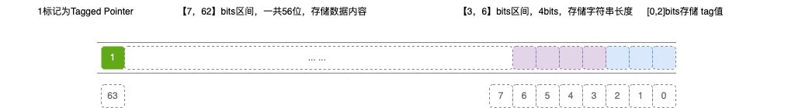


### 2.6  构建Tagged Pointer指针

我们也可以通过代码，构建Tagged Pointer指针

首先看一下源代码实现构建逻辑

```c++
static inline void * _Nonnull
_objc_makeTaggedPointer(objc_tag_index_t tag, uintptr_t value)
{
    return _objc_makeTaggedPointer_withObfuscator(tag, value, objc_debug_taggedpointer_obfuscator);
}

static inline void * _Nonnull
_objc_makeTaggedPointer_withObfuscator(objc_tag_index_t tag, uintptr_t value,
                                       uintptr_t obfuscator)
{
   // MSB布局
    if (tag <= OBJC_TAG_Last60BitPayload) {
        uintptr_t result =
            (_OBJC_TAG_MASK |
             ((uintptr_t)tag << _OBJC_TAG_INDEX_SHIFT) |
             ((value << _OBJC_TAG_PAYLOAD_RSHIFT) >> _OBJC_TAG_PAYLOAD_LSHIFT));
        // 构建好的标识指针进行加密混淆
        return _yp_objc_encodeTaggedPointer_withObfuscator(result, objc_debug_taggedpointer_obfuscator);
    } else {
        uintptr_t result =
            (_OBJC_TAG_EXT_MASK |
             ((uintptr_t)(tag - OBJC_TAG_First52BitPayload) << _OBJC_TAG_EXT_INDEX_SHIFT) |
             ((value << _OBJC_TAG_EXT_PAYLOAD_RSHIFT) >> _OBJC_TAG_EXT_PAYLOAD_LSHIFT));
        return _yp_objc_encodeTaggedPointer_withObfuscator(result, objc_debug_taggedpointer_obfuscator);
    }
}
```

逻辑解释

- 当 `tag <= OBJC_TAG_Last60BitPayload`时，采用的 `MSB`布局
  * `_OBJC_TAG_MASK` = `1LU <<63`，最高位为`1`，表示是`Tagged Pointer`对象；
  * `((uintptr_t)tag << _OBJC_TAG_INDEX_SHIFT)`，目的是让`tag`标记值移动到特定的内存位置，`_OBJC_TAG_INDEX_SHIFT = 0` ，说明`tag`标记值在最低位，占用`3 bits`;
  * `((value << _OBJC_TAG_PAYLOAD_RSHIFT) >> _OBJC_TAG_PAYLOAD_LSHIFT))`，`value`为具体的数据，向左移动`3 bits`，
  * 根据`api`提供的 `标识位` | `tag位` | `数据` 或运算；一个完整的标识指针：`[标识位]（index = 63）+ [数据][62~3]+ tag标识位[0~2]`，符合上述描述的内存布局。

根据内部实现，获取的`Tagged Pointer`指针未区分数据负载内容，此时的内存分布如下图：


#### 2.6-1 `NSNumber`对象构建

我们需要对`[3,6] 4bits`的数据类型，以及`[7,62] 56bits`的数据负载区域进行二进制构建，代码如下：

```objective-c
- (uintptr_t)buildingNumberBinariesWithValue:(long)value type:(NSString *)type {
    
    NSDictionary *dic = @{
        @"char":@(0),
        @"short":@(1),
        @"int":@(2),
        @"long":@(3),
        @"float":@(4),
        @"double":@(5)
    };
    NSNumber *typeNumber = [dic objectForKey:type];
    uintptr_t typeValue = [typeNumber unsignedLongValue];
    uintptr_t result = ((typeValue << 3) | (value << 7)) >> 3;
    void *p = yp_objc_makeTaggedPointer(OBJC_TAG_NSNumber,result);
    
    return (uintptr_t)p;

```

首先获取`NSNumber`对象的数据类型和具体值，然后根据位运算将数据类型和具体值移动到具体`bit`位置，构建得到完整的布局结构，然后右移`3`位得到数据负载内容。

关闭指针混淆，代码验证一下：

```objective-c
NSNumber *number1 = [NSNumber numberWithInt:1];
NSLog(@"number1指针为：%p",number1);

void *p = (void *)[self buildingNumberBinariesWithValue:[number1 longValue] type:@"int"];
printf("构建的原始指针为：0x%lx\n",(uintptr_t)p);

number1指针为：0x8000000000000093
构建的原始指针为：0x8000000000000093
```

结果完全正确✅，完美。

#### 2.6-2 `NSString`对象构建

先看一下构建代码

```objective-c
- (uintptr_t)buildingStringBinariesWithString:(NSString *)str {
    
    NSInteger len = str.length;
    
    uintptr_t res = 0LU;
    
    // 字符串转ASCLL码
    for (int i = 0 ; i < len; i++) {
        int asciicode = [str characterAtIndex:i];
        
        // 根据Unicode编码
        res |= asciicode << (i * 8);
    }
    
    uintptr_t result = ((len << 3) | (res << 7)) >> 3;
    void *p = yp_objc_makeTaggedPointer(OBJC_TAG_NSString,result);
    
    return (uintptr_t)p;

}
```

同样代码验证一下：

```objective-c
NSString *str = [NSString stringWithFormat:@"1"];
NSLog(@"str指针为：%p",str);
void *p1 = (void *)[self buildingStringBinariesWithString:str];
printf("构建的原始指针为：0x%lx\n",result);

str指针为：0x800000000000188a
构建的原始指针为：0x800000000000188a
```

### 2.7 Tagged Pointer注册

在上面讲述了底层是怎么生成特定类型的`Tagged Pointer`指针，为什么`NSNumber、NSDate、NSString`会生成，而其他的不会呢？

加载程序时，从`dyld`库的`_dyld_start()`函数开始，经历了多般步骤，开始调用`_objc_registerTaggedPointerClass()`函数：

```c++
void
_objc_registerTaggedPointerClass(objc_tag_index_t tag, Class cls)
{
    if (objc_debug_taggedpointer_mask == 0) {
        _objc_fatal("tagged pointers are disabled");
    }

    Class *slot = classSlotForTagIndex(tag);
    if (!slot) {
        _objc_fatal("tag index %u is invalid", (unsigned int)tag);
    }

    Class oldCls = *slot;

    if (cls  &&  oldCls  &&  cls != oldCls) {
        _objc_fatal("tag index %u used for two different classes "
                    "(was %p %s, now %p %s)", tag, 
                    oldCls, oldCls->nameForLogging(), 
                    cls, cls->nameForLogging());
    }

    // 如果尚未设置，则将占位类存储在为扩展tag空间保留的基本标记槽中。
    // 在注册第一个扩展标记时延迟执行此操作，以便
    // 旧调试器能够更频繁地正确表征伪指针。
    *slot = cls;
    if (tag < OBJC_TAG_First60BitPayload || tag > OBJC_TAG_Last60BitPayload) {
        // OBJC_TAG_RESERVED_7 == 7
        Class *extSlot = classSlotForBasicTagIndex(OBJC_TAG_RESERVED_7);
        if (*extSlot == nil) {
            extern objc_class OBJC_CLASS_$___NSUnrecognizedTaggedPointer;
            *extSlot = (Class)&OBJC_CLASS_$___NSUnrecognizedTaggedPointer;
        }
    }
}
```

* 判断是否禁用了Tagged Pointer，若禁用，则终止程序
* 根据指定`tag`获取类指针。若`tag`被用于两个不同的类，则终止程序
* 判断负载数据容量如果是52bits进行特殊处理，在`OBJC_TAG_RESERVED_7`处存储占位类`OBJC_CLASS_$___NSUnrecognizedTaggedPointer`

其实这个方法起的名字是注册，其实应该叫校验。校验在全局数组（以`tag`进行位操作为索引，类为`value`的全局数组）中，用 **`tag`取出来的类指针** 与 **注册的类** 是否相符

根据指定`tag`获取类指针函数`classSlotForTagIndex()`：

```c++
// 返回指向tag类数组中类存储的指针，如果标记超出范围，则返回 nil。
static ptrauth_taggedpointer_table_entry Class *
classSlotForTagIndex(objc_tag_index_t tag)
{
    if (tag >= OBJC_TAG_First60BitPayload && tag <= OBJC_TAG_Last60BitPayload) {
        return classSlotForBasicTagIndex(tag);
    }

    if (tag >= OBJC_TAG_First52BitPayload && tag <= OBJC_TAG_Last52BitPayload) {
        int index = tag - OBJC_TAG_First52BitPayload;
#if OBJC_SPLIT_TAGGED_POINTERS
        if (tag >= OBJC_TAG_FirstUnobfuscatedSplitTag)
            return &objc_tag_ext_classes[index];
#endif
        uintptr_t tagObfuscator = ((objc_debug_taggedpointer_obfuscator
                                    >> _OBJC_TAG_EXT_INDEX_SHIFT)
                                   & _OBJC_TAG_EXT_INDEX_MASK);
        return &objc_tag_ext_classes[index ^ tagObfuscator];
    }

    return nil;
}
```

- 根据负载数据容量是`60bits`还是`52bits`，区分为类标识是基础类标识还是扩展类标识。也可以说根据 **`tag`类标识区间** 判断
- `tag`是基础类标识，返回`classSlotForBasicTagIndex(tag)`的结果
- `tag`是扩展类标识，对`tag`进行`位`操作，然后取出存在`objc_tag_ext_classes`数组里的结果返回

这里有两个重要的全局数组：

```c++
#if SUPPORT_TAGGED_POINTERS

extern "C" { 
    extern ptrauth_taggedpointer_table_entry Class objc_debug_taggedpointer_classes[_OBJC_TAG_SLOT_COUNT];
    extern ptrauth_taggedpointer_table_entry Class objc_debug_taggedpointer_ext_classes[_OBJC_TAG_EXT_SLOT_COUNT];
}
#define objc_tag_classes objc_debug_taggedpointer_classes
#define objc_tag_ext_classes objc_debug_taggedpointer_ext_classes

#endif
```

数组`objc_tag_classes`：存储苹果定义的几个基础类
数组`objc_tag_ext_classes`：存储苹果预留的扩展类

```c++
// 返回指向tag类数组中类存储的指针
// 假定该tag是一个有效的基本tag
static ptrauth_taggedpointer_table_entry Class *
classSlotForBasicTagIndex(objc_tag_index_t tag)
{
#if OBJC_SPLIT_TAGGED_POINTERS
    uintptr_t obfuscatedTag = _objc_basicTagToObfuscatedTag(tag);
    return &objc_tag_classes[obfuscatedTag];
#else
    uintptr_t tagObfuscator = ((objc_debug_taggedpointer_obfuscator
                                >> _OBJC_TAG_INDEX_SHIFT)
                               & _OBJC_TAG_INDEX_MASK);
    uintptr_t obfuscatedTag = tag ^ tagObfuscator;

    // Array index in objc_tag_classes includes the tagged bit itself
#   if SUPPORT_MSB_TAGGED_POINTERS
    return &objc_tag_classes[0x8 | obfuscatedTag];
#   else
    return &objc_tag_classes[(obfuscatedTag << 1) | 1];
#   endif
#endif
}
```

* 对`tag`类标识，进行了一系列的位运算
* 根据判断是`macOS or iOS`，来获取`objc_tag_classes`数组里面的类指针


## 3. Tagged Pointer 表示数值范围

---

### `NSNumber`表示的数值范围

`Tagged Pointer`指针 `8` 个字节，`64` 个比特位，第 `1` 个比特位用于标记是否是 `Tagged Pointer`，第 `2~4` 比特位用于标记 `Tagged Pointer` 的指针类型，解码后的最后 `4` 个比特位用于标记 `value` 的长度，那么用于存储 `value` 的比特位只有 `56 bits`，根据一个字节`8 bit`，共有`7 bits`存储空间。

`7 bits` 存储整数的话 ，最高位为`0`，其余位为`1`,  最大可存储的值为`2^55 - 1 或者(0x7fffffffffffff)`

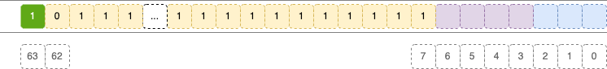

存储最小值的话，是不是`-2^56`呢，我们代码验证一下：

```objective-c
long v = - (pow(2, 55));
NSNumber *number1 = [NSNumber numberWithLong:v];

number1指针为：0x600000766580
```

很明显`number1`指针是指向堆内存区域，如果设置大的数值呢？

```objective-c
long v = - (pow(2, 55));
NSNumber *number1 = [NSNumber numberWithLong:v + 1];

number1指针为：0xc00000000000009b
```

为什么会这样呢？按照我们学习[基础数据存储到二进制的最大最小数值表示范围](https://blog.csdn.net/weixin_42089228/article/details/109102060)，一个有符号的整数，占`n`位字节，那么取值范围为[-2^(n-1)，2^(n-1) - 1]，`NSNumber`对象的取值范围，理论上是[-2^55，2^55 - 1]。

查询了很多资料，也没有找到具体的解释，个人猜测属于内部编码的优化。

当数值不在[-2^55 + 1，2^55 - 1]范围内，系统会在堆区分配内存进行存储。

### `NSString`表示的数值范围

当字符串长度超过多少，对象类型就不再是`NSTaggedPointerString`了呢？

我们通过代码测试一下：

```objective-c
NSString *str1 = [NSString stringWithFormat:@"1"];
NSString *str2 = [NSString stringWithFormat:@"12"];
NSString *str3 = [NSString stringWithFormat:@"123"];
NSString *str4 = [NSString stringWithFormat:@"1234"];
NSString *str5 = [NSString stringWithFormat:@"12345"];
NSString *str6 = [NSString stringWithFormat:@"123456"];
NSString *str7 = [NSString stringWithFormat:@"1234567"];
NSString *str8 = [NSString stringWithFormat:@"12345678"];
NSString *str9 = [NSString stringWithFormat:@"123456789"];
NSString *str10 = [NSString stringWithFormat:@"1234567890"];

2024-12-19 00:45:59.939825+0800 YPTaggedPointerDemo[42080:14513093] str1 指针为：0x800000000000188a
2024-12-19 00:45:59.939908+0800 YPTaggedPointerDemo[42080:14513093] str2 指针为：0x8000000000191892
2024-12-19 00:45:59.939955+0800 YPTaggedPointerDemo[42080:14513093] str3 指针为：0x800000001999189a
2024-12-19 00:45:59.940003+0800 YPTaggedPointerDemo[42080:14513093] str4 指针为：0x8000001a199918a2
2024-12-19 00:45:59.940042+0800 YPTaggedPointerDemo[42080:14513093] str5 指针为：0x80001a9a199918aa
2024-12-19 00:45:59.940076+0800 YPTaggedPointerDemo[42080:14513093] str6 指针为：0x801b1a9a199918b2
2024-12-19 00:45:59.940111+0800 YPTaggedPointerDemo[42080:14513093] str7 指针为：0x9b9b1a9a199918ba
2024-12-19 00:45:59.940144+0800 YPTaggedPointerDemo[42080:14513093] str8 指针为：0x803d43ee57661542
2024-12-19 00:45:59.940176+0800 YPTaggedPointerDemo[42080:14513093] str9 指针为：0x8f50fb95d98558ca
2024-12-19 00:45:59.940209+0800 YPTaggedPointerDemo[42080:14513093] str10 指针为：0x6000017f2660
```

如果根据`Unicode`编码，`Tagged Pointer`指针最多能容纳`7`个字符，但上面打印字符串长度大于`7`时还是`Tagged Pointer`对象，为什么呢？很想探寻内部的原理，这个时候我们可以通过`Hopper`反编译去了解，具体反编译过程参考:[iOS开发Tagged Pointer的字符串](https://blog.csdn.net/MinggeQingchun/article/details/70624832)

先说结论：

* 如果长度介于`0`到`7`，直接用`Unicode`八位编码存储字符串。
* 如果长度是`8`或者`9`，用六位编码存储字符串，使用编码表“eilotrm.apdnsIc ufkMShjTRxgC4013bDNvwyUL2O856P-B79AFKEWV_zGJ/HYX”。
* 如果长度是10或11，用五位编码存储字符串,使用编码表“eilotrm.apdnsIc ufkMShjTRxgC4013”

我们根据上面打印的数据进行分析

```objective-c
str1 指针为：0x800000000000188a => 0b 1000 0000 0000 0000 0000 0000 0000 0000 0000 0000 0000 0000 0001 1000 1000 1010
[tag位+存储位+数据类型+tag标记]   => 0b 1 /0000 0000 /0000 0000 /0000 0000 /0000 0000 /0000 0000 /0000 0000 /0011 0001 /0001 010
// 0011 0001 = 49，ASCII码表示 '1'
  
str2 指针为：0x8000000000191892 => 0b 1000 0000 0000 0000 0000 0000 0000 0000 0000 0000 0001 1001 0001 1000 1001 0010
[tag位+存储位+数据类型+tag标记]   => 0b 1 /0000 0000 /0000 0000 /0000 0000 /0000 0000 /0000 0000 /0011 0010 /0011 0001 /0010 010
//0011 0010  0011 0001 = 50 49，ASCII码表示 '2''1'
  
str3 指针为：0x800000001999189a => 0b 1000 0000 0000 0000 0000 0000 0000 0000 0001 1001 1001 1001 0001 1000 1001 1010
[tag位+存储位+数据类型+tag标记]   => 0b 1 /0000 0000 /0000 0000 /0000 0000 /0000 0000 /0011 0011 /0011 0010 /0011 0001 /0010 010  
  
str4 指针为：0x8000001a199918a2 => 0b 1000 0000 0000 0000 0000 0000 0001 1010 0001 1001 1001 1001 0001 1000 1010 0010
[tag位+存储位+数据类型+tag标记]   => 0b 1 /0000 0000 /0000 0000 /0000 0000 /0011 0100 /0011 0011 /0011 0010 /0011 0001 /0010 010  
  
str5 指针为：0x80001a9a199918aa => 0b 1000 0000 0000 0000 0001 1010 1001 1010 0001 1001 1001 1001 0001 1000 1010 1010
[tag位+存储位+数据类型+tag标记]   => 0b 1 /0000 0000 /0000 0000 /0011 0101 /0011 0100 /0011 0011 /0011 0010 /0011 0001 /0010 010 
  
str6 指针为：0x801b1a9a199918b2 => 0b 1000 0000 0001 1011 0001 1010 1001 1010 0001 1001 1001 1001 0001 1000 1011 0010
[tag位+存储位+数据类型+tag标记]   => 0b 1 /0000 0000 /0011 0110 /0011 0101 /0011 0100 /0011 0011 /0011 0010 /0011 0001 /0010 010 
  
str7 指针为：0x9b9b1a9a199918ba => 0b 1001 1011 1001 1011 0001 1010 1001 1010 0001 1001 1001 1001 0001 1000 1011 1010
[tag位+存储位+数据类型+tag标记]   => 0b 1 /0011 0111 /0011 0110 /0011 0101 /0011 0100 /0011 0011 /0011 0010 /0011 0001 /0010 010 
```

**有上述打印可知，当字符串长度等于`7`时，数据负载位全被填充，内存从低位到高位写入**

当长度是`8`或者`9`时

```objective-c
str8 指针为：0x801b1a9a199918b2 => 0b 1000 0000 0011 1101 0100 0011 1110 1110 0101 0111 0110 0110 0001 0101 0100 0010
[tag位+存储位+数据类型+tag标记]   => 0b 1 /00 /000000 /011110 /101000 /011111 /011100 /101011 /101100 /110000 /101010 /1000 010 
将二进制转换为6位编码格式：              => 0b 1 /00 /     0 /    30 /    40 /    31 / 28    / 43    / 44    / 48    / 42

str9 指针为：0x8f50fb95d98558ca => 0b 1000 1111 0101 0000 1111 1011 1001 0101 1101 1001 1000 0101 0101 1000 1100 1010
[tag位+存储位+数据类型+tag标记]   => 0b 1 /00 /011110 /101000 /011111 /011100 /101011 /101100 /110000 /101010 /110001 /1001 010 
将二进制转换为6位编码格式：              => 0b 1 /00 /    30 /    40 /    31 /    28 / 43    / 44    / 48    / 42    / 49
```

根据转换的`index`在编码表中取对应的值

```objective-c
NSString *str= @"eilotrm.apdnsIc ufkMShjTRxgC4013bDNvwyUL2O856P-B79AFKEWV_zGJ/HYX";
```

打印`str8`指针的值，检验一下是否是`6`位编码

```objective-c
char asc = [str characterAtIndex:30]; // '1'
char asc = [str characterAtIndex:40]; // '2'
char asc = [str characterAtIndex:31]; // '3'
char asc = [str characterAtIndex:28]; // '4'
char asc = [str characterAtIndex:43]; // '5'
char asc = [str characterAtIndex:44]; // '6'
char asc = [str characterAtIndex:48]; // '7'
char asc = [str characterAtIndex:42]; // '8'
```

跟初始值结果一样，同样打印`str9`指针的值

```objective-c
// 前8位字符串和 str8 一样
char asc = [str characterAtIndex:49]; // '9'
```

同样正确✅

**从上述二进制看，`6`位编码最多容纳`9`个字符；不过是从内存高位向低位写入。**

当长度是`10`或者`11`时，用五位编码存储字符串，但是在上面打印`str10`时，已经不是一个`Tagged Pointer`对象。

如果使用`5`位编码存储字符串，我们将二进制的布局拆解一下

```
0b 1 0 [00000] [00000] [00000] [00000] [00000] [00000] [00000] [00000] [00000] [00000] [00000] [1001] [010]
```

**根据布局，`5`位编码最多容纳`11`个字符**

`str10`值长度为`10`，没有溢出，为什么不能生成`Tagged Pointer`对象，我们分析一下`5`位编码表`eilotrm.apdnsIc ufkMShjTRxgC4013`，我们发现`5`位编码表中能表示的字符非常有限

```objective-c
// 未包含的常用字符
'2'、'5'、'6'、'7'、'8'、'9'、'b'、'q'、'v'、'w'、'y'、'z' 等等
```

所以当长度是`10`或者`11`的字符串，当字符串中存在`5`位编码表中未包含的字符时，就无法识别，就会转成一个正常`NSObject`对象。那我们改一下字符串内容：

```objective-c
NSString *str10 = [NSString stringWithFormat:@"4111111113"];
NSString *str11 = [NSString stringWithFormat:@"04111111111"];
NSString *str12 = [NSString stringWithFormat:@"111111111111"];

2024-12-19 14:31:05.155157+0800 YPTaggedPointerDemo[48702:14844543] str10 指针为：0x81cf7bdef7bdefd2
2024-12-19 14:31:05.155231+0800 YPTaggedPointerDemo[48702:14844543] str11 指针为：0xbbcf7bdef7bdef5a
2024-12-19 14:31:05.155276+0800 YPTaggedPointerDemo[48702:14844543] str12 指针为：0x600000a22c80
```

```objective-c
str10 指针为：0x81cf7bdef7bdefd2 => 0b 1000 0001 1100 1111 0111 1011 1101 1110 1111 0111 1011 1101 1110 1111 1101 0010
[tag位+存储位+数据类型+tag标记]   => 0b 1 0 /00000 /11100 /11110 /11110 /11110 /11110 /11110 /11110 /11110 /11110 /11111 /1010 010 
将二进制转换为5位编码格式：              => 0b 1 0 /0     /28    /30    /30    /30    /30    /30    /30    /30    /30    /31    /

str11 指针为：0xbbcf7bdef7bdef5a => 0b 1011 1011 1100 1111 0111 1011 1101 1110 1111 0111 1011 1101 1110 1111 0101 1010
[tag位+存储位+数据类型+tag标记]    => 0b 1 0 /11101 /11100 /11110 /11110 /11110 /11110 /11110 /11110 /11110 /11110 /11110 /1011 010 
将二进制转换为5位编码格式：               => 0b 1 0 /29    /28    /30    /30    /30    /30    /30    /30    /30    /30    /30    /
```

根据转换的`index`在编码表中取对应的值

```objective-c
NSString *str= @"eilotrm.apdnsIc ufkMShjTRxgC4013";
```

打印`str10`，`str11`指针的值，检验一下是否是`5`位编码

```objective-c
char asc = [str characterAtIndex:28]; // '4'
char asc = [str characterAtIndex:29]; // '0'
char asc = [str characterAtIndex:30]; // '1'
char asc = [str characterAtIndex:31]; // '3'

将str10指针二进制转换为5位编码格式：              => 0b 1 0 /0     /28    /30    /30    /30    /30    /30    /30    /30    /30    /31  
最后结果为：4111111113
  
将str11指针二进制转换为5位编码格式：              => 0b 1 0 /29    /28    /30    /30    /30    /30    /30    /30    /30    /30    /30 
最后结果为：04111111111
```

跟初始值结果一样

## 4. Tagged Pointer 应用

---

`objc_msgSend`能识别Tagged Pointer，比如`NSNumber`的`intValue`方法，直接从指针提取数据，不会进行`objc_msgSend`的三大流程，节省了调用开销（消息转发、寻找`isa`指向等）

[内存管理](https://edu.csdn.net/cloud/houjie?utm_source=highword&spm=1001.2101.3001.7020)相关的，如`retain`方法中调用的`rootRetain`：

```c++
ALWAYS_INLINE id 
objc_object::rootRetain(bool tryRetain, bool handleOverflow)
{
    // 如果是 tagged pointer，直接返回 this
    if (isTaggedPointer()) return (id)this; 

    bool sideTableLocked = false;
    bool transcribeToSideTable = false; 

    isa_t oldisa;
    isa_t newisa;
    ......
}
```

判断如果是`Tagged Pointer`对象，则直接返回；

## 5. Tagged Pointer 注意点

---

我们知道，所有OC对象都有`isa`指针，而Tagged Pointer并不是真正的对象，它没有`isa`指针，所以如果你直接访问Tagged Pointer的`isa成员`的话，将会有如下错误：

```objective-c
NSString *str= @"eilotrm.apdnsIc ufkMShjTRxgC4013";
NSLog(@"%p", str->isa);

⚠️❌ Direct access to Objective-C's isa is deprecated in favor of object_getClass()
```

对于`Tagged Pointer`，应该换成相应的方法调用，如`isKindOfClass`和`object_getClass`。

我们通过 LLDB 打印`Tagged Pointer`的`isa`，会提示如下错误：

```
(lldb) p str10->isa
error: Couldn't apply expression side effects : Couldn't dematerialize a result variable: couldn't read its memory
```

正常OC对象访问：

```objective-c
(lldb) p str12->isa
(Class) $1 = __NSCFString
```

## 参考文章

---

[iOS - 老生常谈内存管理（五）：Tagged Pointer](https://juejin.cn/post/6844904132940136462)

[iOS 从源码解析Runtime (一)：Tagged Pointer知识点解读](https://juejin.cn/post/6872655753174810631)

[【iOS  Tagged Pointer】](https://blog.csdn.net/XY_Mckevince/article/details/140513115)

[tagged pointer](https://blog.csdn.net/WangErice/article/details/91048938)

[https://juejin.cn/post/6887543378628902925](OC内存管理-Tagged Pointer初探)


